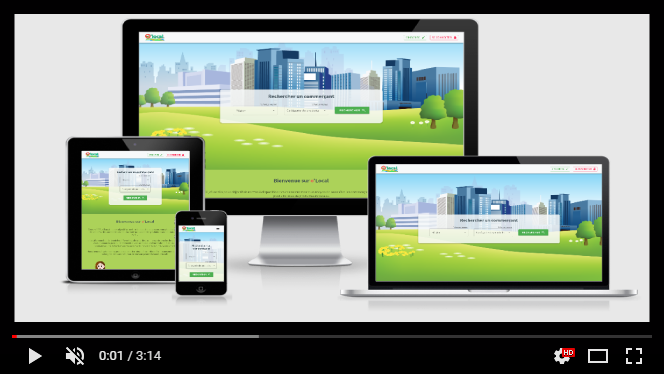
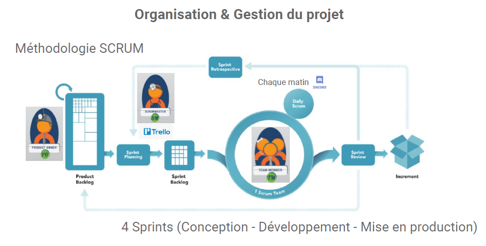

    

# Projet o'Local

      

#### &middot; Présentation du projet (Vidéo démo Apothéose [O'clock](https://oclock.io/) Atlantis 04/05/2020) :

------------
*o'Local est le fruit de 4 développeurs passionnés qui, dans le cadre de leur projet de fin d'études, ont fait le choix de mettre à profit leurs compétences sur un sujet qui leur tenait à coeur, aux enjeux économiques et aux défis environnementaux actuels.*

---

## Installation
- [FrontEnd (React)](React/README.md)

- [BackEnd (Symfony)](Symfony/README.md)

## Documentation
 - [x] [Cahier des Charges](https://docs.google.com/document/d/e/2PACX-1vT_Zmc170UWJpQecezFcp_aA4VB2UXF9GFvAhTcJ-dpplNgxU3kh0QZ7Shkv0eW35j3kE2viRbmGpnc/pub)
 - [x] [Arborescence de l'application](https://whimsical.com/olocal-arborescence-VuvsKDsPGs2NEi2UJDatns)
 - [x] [Wireframes](https://whimsical.com/olocal-wireframes-99ShBgnBHj98LsvgSgrBFB)
 - [x] [Dictionnaire des données](https://docs.google.com/document/d/e/2PACX-1vTDs-1GRrJ5XU7N6C70fUfol-HWde0oaSagutVCI0fuNJEpCJTAuf7cDPRZItJhKzzsY2UP3ImFQtGS/pub)
 - [x] [Modèle Conceptuel de Données](docs/mcd.png)
 - [x] [Modèle Physique des Données](docs/mpd.png)
